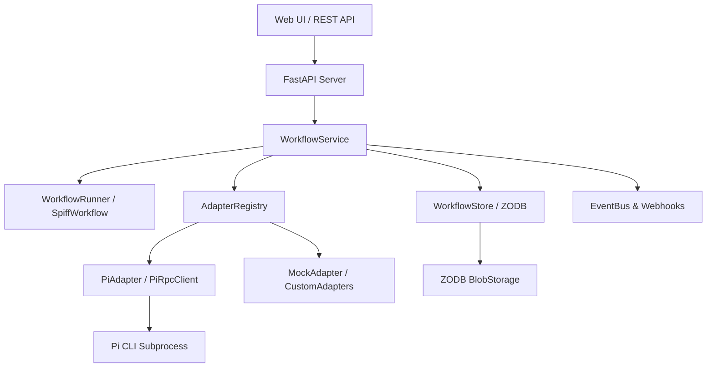

# Architecture Overview

**BPMN Pi Workflow** is a durable BPMN 2.0 orchestration engine combining local AI execution with transactional persistence and human-in-the-loop task forms.



## Core Subsystems

### 1. BPMN Engine & Execution Scope
- Powered by **SpiffWorkflow**, diagrams parsed from `workflows/*.bpmn`.
- Tasks execute in topological order; script tasks and service tasks update the workflow environment.
- Service tasks declare their AI harness via `camunda:properties` (`harness_type="pi_agent"` and `agent_role="code_reviewer"`).
- Exclusive gateways evaluate Python expressions against merged `task.data` and `workflow.data` (e.g. `agent_status == 'success'`).

### 2. Persistence Layer (ZODB + Blobs)
- **WorkflowStore** manages ACID persistence backed by ZODB (in-memory, file storage `Data.fs`, or remote ZEO).
- Workspace files are packaged as compressed `tar.zst` blobs and saved in `ZODB.blob.Blob`.
- In-place mutation with conflict retry decorators ensures zero lost updates and thread safety under concurrent load.
- Metastore tree keeps lightweight summaries (`WorkflowMetadata`) for fast indexing and pagination without scanning large instance graphs.

### 3. Pi AI Agent Integration
- **PiRpcClient** invokes the Pi agent as an isolated subprocess with `--mode rpc`.
- Bidirectional JSONL streaming receives structured events (`tool_call`, `message_end`, `agent_settled`).
- Standard 5-key JSON output contract:
  ```json
  {
    "status": "success",
    "summary": "Analysis findings",
    "findings": ["item 1", "item 2"],
    "artifacts": ["document.md"],
    "next_action": "continue"
  }
  ```

### 4. Savepoints & Timeline Forking
- Automated savepoints captured at durable boundaries:
  - `before_harness`: Prior to launching an agent subprocess.
  - `after_harness`: Immediately upon successful completion of an agent step.
  - `human_wait`: When execution enters a `UserTask`.
- Any savepoint can be branched via `POST /instance/{id}/fork/{savepoint_id}`, duplicating the workflow state and workspace blob into a new execution branch.

### 5. Human Tasks & FormJS
- `UserTask` elements declare fields using `camunda:formData`.
- Auto-mapped to FormJS JSON schema (`CAMUNDA_TO_FORMJS_TYPE`) and rendered via `@bpmn-io/form-js`.
