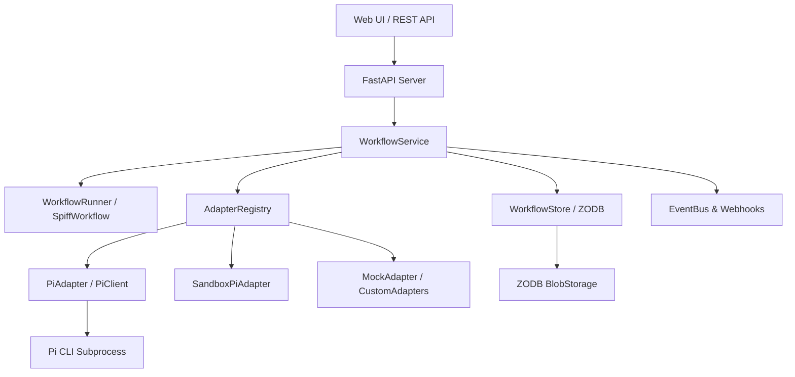

# Architecture Overview

> AGENTS.md's "Architecture & Module Map" is the file-by-file reference and changes first;
> this doc goes deeper on the subsystems below (savepoints, concurrency, Project children) as
> prose. If the two disagree, AGENTS.md is the one to trust.

**BPMN Pi Workflow** is a durable BPMN 2.0 orchestration engine combining local AI execution with transactional persistence and human-in-the-loop task forms.



## Core Subsystems

### 1. BPMN Engine & Execution Scope
- Powered by **SpiffWorkflow 3.2.0**, diagrams parsed from `graph_agent/data/workflows/*.bpmn`.
- Instances persisted by earlier versions are upgraded on read by `graph_agent/migrations.py`
  (`migrate_workflow_object`), which is idempotent and runs on both `load()` and
  `load_save_point()`, so a stored workflow never has to be migrated by hand.
- Tasks execute in topological order; script tasks and service tasks update the workflow environment.
- Service tasks declare their AI harness via `camunda:properties` (`harness_type="pi_agent"` and `agent_role="code_reviewer"`).
- Exclusive gateways evaluate Python expressions against merged `task.data` and `workflow.data` (e.g. `agent_status == 'success'`).
- A `subProcess triggeredByEvent="true"` with a message start event spawns one **child
  instance per caught message**, letting a long-running parent fan out work while staying
  open. See [Project processes and spawned children](#6-project-processes-and-spawned-children).

### 2. Persistence Layer (ZODB + Blobs)
- **WorkflowStore** manages ACID persistence backed by ZODB (in-memory or file storage `Data.fs`), local to the workspace's `.agents/state/`.
- Workspace files are packaged as compressed `tar.zst` archives and stored in a
  `ZODB.blob.Blob` (`workspace_blob`), which keeps the bytes out of the main `Data.fs`
  transaction log. Instances written before this change kept the archive inline as
  `workspace_archive`; that read path is still honoured, so old instances load unchanged.
- `GET /instance/{id}/workspace/files` serves a manifest of the archive, and
  `GET /instance/{id}/workspace/file?path=…` streams a single file out of it without
  unpacking the whole workspace. The manifest is also surfaced on the instance state as
  `workspace_metadata`, which is what the instance view's **Workspace Files** panel renders.
- In-place mutation with conflict retry decorators ensures zero lost updates and thread safety under concurrent load.
- Metastore tree keeps lightweight summaries (`WorkflowMetadata`) for fast indexing and pagination without scanning large instance graphs.

### 3. Pi AI Agent Integration
- **PiClient** invokes the Pi agent as an isolated subprocess in non-interactive JSON print
  mode: `pi --mode json -p <prompt> --no-approve`.
- Turns are **stateless and step-by-step**. Context carries across turns by propagating
  `session_id` (`--session`, or `--fork` when a savepoint fork should branch the session
  rather than continue it); the mapping lives in `workflow.data["__sessions"]`.
- Standard 5-key JSON output contract:
  ```json
  {
    "status": "success",
    "summary": "Analysis findings",
    "findings": ["item 1", "item 2"],
    "artifacts": ["document.md"],
    "next_action": "continue"
  }
  ```

### 4. Savepoints & Timeline Forking
- Automated savepoints captured at durable boundaries:
  - `before_harness`: Prior to launching an agent subprocess.
  - `after_harness`: Immediately upon successful completion of an agent step.
  - `human_wait`: When execution enters a `UserTask`.
- Each savepoint carries an **independent copy of the workspace** as its own Blob, so a fork
  resumes with exactly the files the agent had written by that point. Two forks from one
  savepoint get independent workspaces and cannot disturb each other.
- Any savepoint can be branched via `POST /instance/{id}/fork/{savepoint_id}`, duplicating the
  workflow state and workspace blob into a new execution branch.
- Because savepoints carry workspaces, a long-running instance grows. Retention is a
  **deliberate manual purge** (`DELETE /instance/{id}/savepoints`), not an age or count policy:
  only a person can judge which past states are still worth forking from.

### 5. Human Tasks & FormJS
- `UserTask` elements declare fields using `camunda:formData`.
- Auto-mapped to FormJS JSON schema (`CAMUNDA_TO_FORMJS_TYPE`) and rendered via `@bpmn-io/form-js`.

### 6. Project processes and spawned children

A **Project** is not a separate database entity — it is an ordinary long-running BPMN process
(`graph_agent/data/workflows/project.bpmn`) that stays parked on a human task and spawns a child for each
`spawn_requested` message it receives:

```http
POST /instance/{project_id}/message/spawn_requested
Content-Type: application/json

{ "payload": { "task_brief": "Audit the docs tree against shipped features" } }
```

Children come in two kinds, and the distinction is deliberate:

| | CallActivity child | Event-subprocess child |
| :--- | :--- | :--- |
| Modelled as | `bpmn:callActivity` | `bpmn:subProcess triggeredByEvent="true"` |
| Lifetime | bounded; the parent joins back on its result | unbounded; parent only needs it to have happened |
| Parent while it runs | blocked at the call | stays open, keeps accepting more spawns |
| Use when | the parent needs the result | the parent needs the work done, not the answer |

Event-subprocess children are **nested inside the parent's workflow object**, so they share the
root instance's workspace and appear inside the parent's savepoints. They are synchronised as
child records (`parent_workflow_id`, and the parent's `__children` map) exactly like
CallActivity children, so every per-instance route works on them.

### 7. Concurrency and the shared workspace

Parallel branches of one instance share a single workspace directory. A turn that repacks a
workspace older than the one already stored is **refused** rather than silently overwriting a
sibling's files: the task fails with a readable `failure_reason` and can be retried explicitly
through `POST /instance/{id}/retry/{task_id}`. Nothing retries it automatically — an automatic
retry would re-run against a workspace the turn never agreed on.

This is an interim guard, not the end state; a per-branch worktree model is the intended fix.
