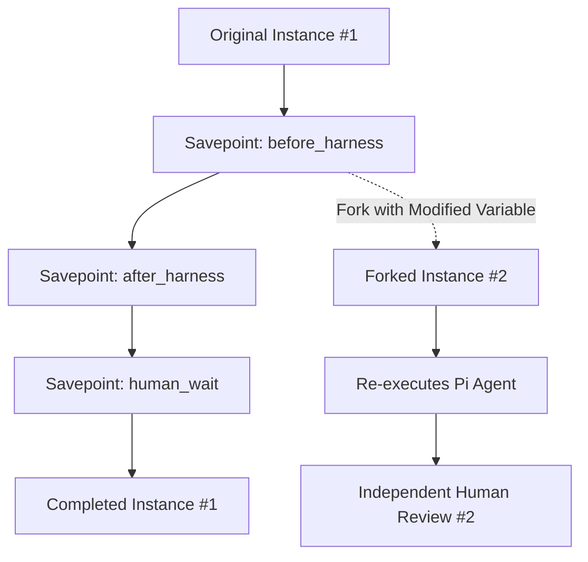
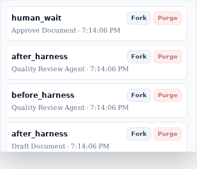

# Save Points & Timeline Forking

Pi Workflow Studio introduces durable **Save Points** and **Timeline Forking**, allowing developers and business operators to checkpoint process executions, inspect point-in-time variable snapshots, and branch new timelines from historical execution states.

---

## 1. Save Point Checkpoint Phases

During the execution of a BPMN process, save points are automatically captured at critical wait and execution boundaries:

| Save Point Phase | Captured At | Purpose & Resume Action |
| :--- | :--- | :--- |
| `before_harness` | Immediately before dispatching task to Pi agent | Allows re-running the AI agent with modified prompts or model parameters. |
| `after_harness` | Immediately after the Pi agent completes | Allows resuming downstream workflow logic without re-incurring AI cost or latency. |
| `human_wait` | When a User Task enters `READY` state | Captures full state prior to human intervention for audit trails and what-if testing. |


Every savepoint stores three things: the serialized workflow state, the variable payload as of
that moment, and an **independent copy of the agent's workspace**. The workspace copy is what
makes a fork faithful — without it a fork would resume with the right variables but the wrong
files on disk.

---

## 2. Timeline Forking

Any past save point can be forked into a brand new, independent workflow instance via the UI or API:

```http
POST /instance/{workflow_id}/fork/{save_point_id}
Content-Type: application/json

{
  "variables": {
    "contract": "Amended clause text for what-if evaluation"
  }
}
```

### Forking Workflow



When an instance is forked:
1. The historical savepoint's serialized state is cloned.
2. The savepoint's workspace Blob is duplicated into a **fresh, independent workspace** for the
   fork, so the new branch starts with exactly the files that existed at that point and cannot
   disturb the original or any sibling fork.
3. Any variable overrides supplied in the fork request are merged into the workflow scope.
4. A new unique `workflow_id` is assigned and persisted to ZODB.
5. Execution resumes according to the save point's `resume_action` (`run_harness` or `complete_harness`).

Forking from a savepoint taken *before* any agent ran still works, and correctly starts from a
clean workspace.


---

## 3. Purging Save Points

Savepoints carry workspaces, so a long-running instance accumulates real storage. Retention is
therefore a **manual purge**, never an automatic age or count policy — only a person can judge
which past states are still worth forking from.

Each savepoint in the instance view carries a **Purge** action beside its Fork action. It is
styled as secondary and destructive, and always confirms first, naming both the anchor element
and the number of savepoints that will be deleted:

> This will permanently delete 2 savepoints recorded before "Quality Review Agent". This cannot
> be undone.



The anchor is an **element**, not a timestamp: nobody remembers when a savepoint was taken, but
they remember what had been done by then. Every savepoint belonging to the anchor task is kept,
along with everything newer — an agent task records both a `before_harness` and an
`after_harness` savepoint, and purging from either one keeps both.

```http
DELETE /instance/{workflow_id}/savepoints
Content-Type: application/json

{ "before_task_id": "7fae39ca-8cb1-4b73-8ffa-9c17aea56859" }
```

Exactly one anchor is required — `before_task_id`, or `before` with an ISO-8601 timestamp. A
request carrying neither or both is rejected with `400`, so a malformed call can never be
interpreted as "purge everything". Forks already taken from a purged instance keep working;
they own their own copies.

---

## 4. Benefits of Savepoint Branching

- **Cost Efficiency**: Skip expensive LLM re-computation by forking `after_harness` or `human_wait`.
- **Reproducibility & Debugging**: Re-run failing agent prompts under identical initial conditions by forking `before_harness`.
- **A/B Process Experimentation**: Test different contract amendment scenarios in parallel from the same baseline.
