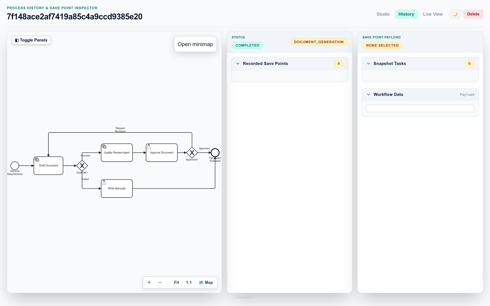
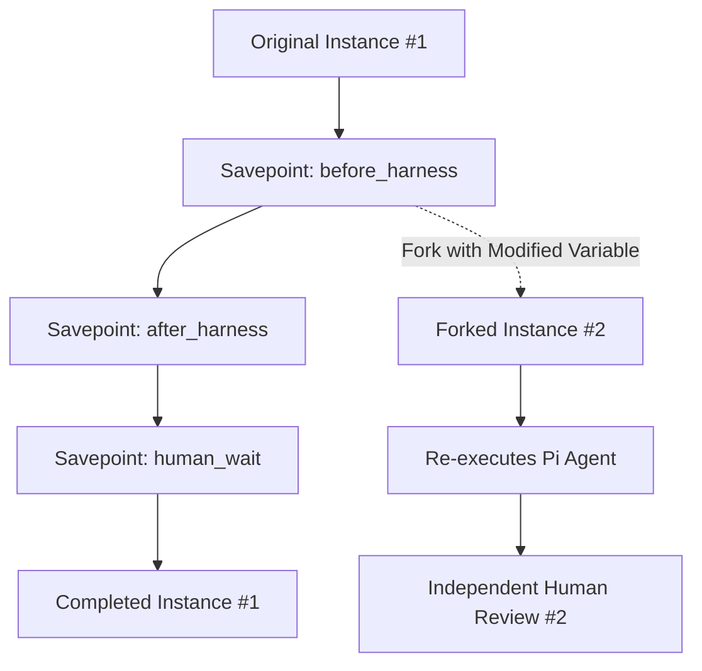

# Save Points & Timeline Forking

Pi Workflow Studio introduces durable **Save Points** and **Timeline Forking**, allowing developers and business operators to checkpoint process executions, inspect point-in-time variable snapshots, and branch new timelines from historical execution states.

---

## 1. Save Point Checkpoint Phases

During the execution of a BPMN process, save points are automatically captured at critical wait and execution boundaries:

| Save Point Phase | Captured At | Purpose & Resume Action |
| :--- | :--- | :--- |
| `before_harness` | Immediately before dispatching task to Pi agent | Allows re-running the AI agent with modified prompts or model parameters. |
| `after_harness` | Immediately after the Pi agent completes | Allows resuming downstream workflow logic without re-incurring AI cost or latency. |
| `human_wait` | When a User Task enters `READY` state | Captures full state prior to human intervention for audit trails and what-if testing. |



---

## 2. Timeline Forking

Any past save point can be forked into a brand new, independent workflow instance via the UI or API:

```http
POST /instance/{workflow_id}/fork/{save_point_id}
Content-Type: application/json

{
  "variables": {
    "contract": "Amended clause text for what-if evaluation"
  }
}
```

### Forking Workflow



When an instance is forked:
1. The historical savepoint's serialized state is cloned.
2. Any variable overrides supplied in the fork request are merged into the workflow scope.
3. A new unique `workflow_id` is assigned and persisted to ZODB.
4. Execution resumes according to the save point's `resume_action` (`run_harness` or `complete_harness`).


---

## 3. Benefits of Savepoint Branching

- **Cost Efficiency**: Skip expensive LLM re-computation by forking `after_harness` or `human_wait`.
- **Reproducibility & Debugging**: Re-run failing agent prompts under identical initial conditions by forking `before_harness`.
- **A/B Process Experimentation**: Test different contract amendment scenarios in parallel from the same baseline.
