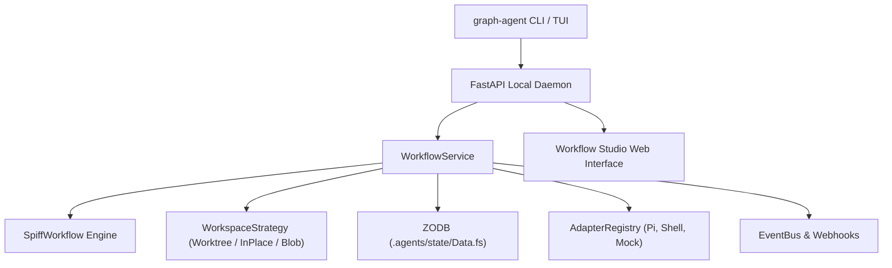

# graph-agent Documentation

**graph-agent** is a durable orchestration engine pairing **BPMN 2.0 executable workflows** (powered by [SpiffWorkflow](https://github.com/sartography/SpiffWorkflow)) with **autonomous local AI agents** (executed as stateless, step-by-step turns via Pi CLI or deterministic tools), **ACID-compliant ZODB persistence**, **isolated filesystem workspace strategies** (`worktree`, `in_place`, `blob`), **SavePoint timeline forking**, and **FormJS human review checkpoints**.

---

## Architecture & Interfaces

---

## Core Capabilities

- **BPMN 2.0 Process Controller**: Industrial-strength business process execution with exclusive/parallel gateways, CallActivity sub-processes, message catch events, and user tasks.
- **In-Flight Spec Replacement & Dynamic Graph Extension**: Seamlessly update running BPMN diagrams in-flight (`replace_spec`), validate migrations, and programmatically insert new tasks (`extend_graph`) via self-extending meta-workflows.
- **Local Agent Harnesses**: Step-by-step turns dispatched to local agent harnesses (Pi CLI via `pi_agent`, `SandboxPiAdapter` with Podman isolation, deterministic build steps via `ShellAdapter`, or graph extenders via `GraphExtendAdapter`).
- **Isolated Workspace Strategies**:
  - `worktree`: Runs each workflow on a dedicated Git branch (`bpmn/run/<id>`) in `.agents/worktrees/<id>` with auto-merge on clean completion.
  - `in_place`: Runs directly in the project root with a serialized `asyncio.Lock` workspace mutex for non-Git repositories.
  - `blob`: Ephemeral scratch execution packed into compressed ZODB blobs.
- **ZODB ACID Durability**: Transactional persistence local to the workspace (`.agents/state/Data.fs`) with automatic crash recovery.
- **SavePoints & Timeline Forking**: Automatic snapshotting at critical boundaries (`before_harness`, `after_harness`, `human_wait`), enabling reliable state rewinds and branch exploration.
- **Terminal UI (TUI) & Web Studio**:
  - Interactive terminal interface (`Runs`, `RunDetail`, `Inbox`, `Form`, `Start`, `Log`).
  - Web dashboard with interactive BPMN diagram viewer, visual modeler, and FormJS task forms.
- **Single Workspace Supervisor**: Long-running supervisor processes (`workflows/project.bpmn`) that park on message events and spawn child tasks.

---

## Documentation Guide

### 🚀 Getting Started & Architecture
- [Architecture Overview](architecture.md)
- [Meta-Agent Operating Model](meta-agent.md)
- [Getting Started & Development Guide](development/getting-started.md)
- [Testing & Verification Guide](development/testing-verification.md)
- [End-to-End Usage Story & Walkthrough](usage-story.md)

### 🛠️ Reference & Extensibility
- [REST & WebSocket API Reference](api-reference.md)
- [Authoring BPMN Workflows](authoring-workflows.md)
- [Extending Adapters](extending-adapters.md)
- [Variable Scoping Reference](variable-scoping-plan.md)

### 🔍 Features Deep Dive
- [BPMN Orchestration & ZODB](features/orchestration.md)
- [Pi AI Agent Integration](features/ai-agent-integration.md)
- [SavePoints & Timeline Forking](features/savepoints-forking.md)
- [Web Interface & FormJS](features/web-ui.md)
- [Process History & Analytics](features/history-analytics.md)
