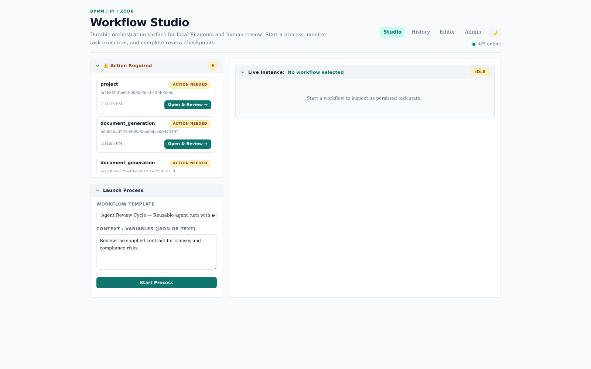
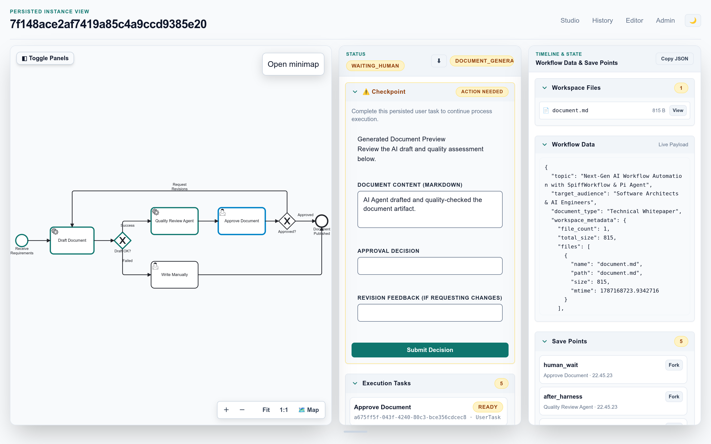
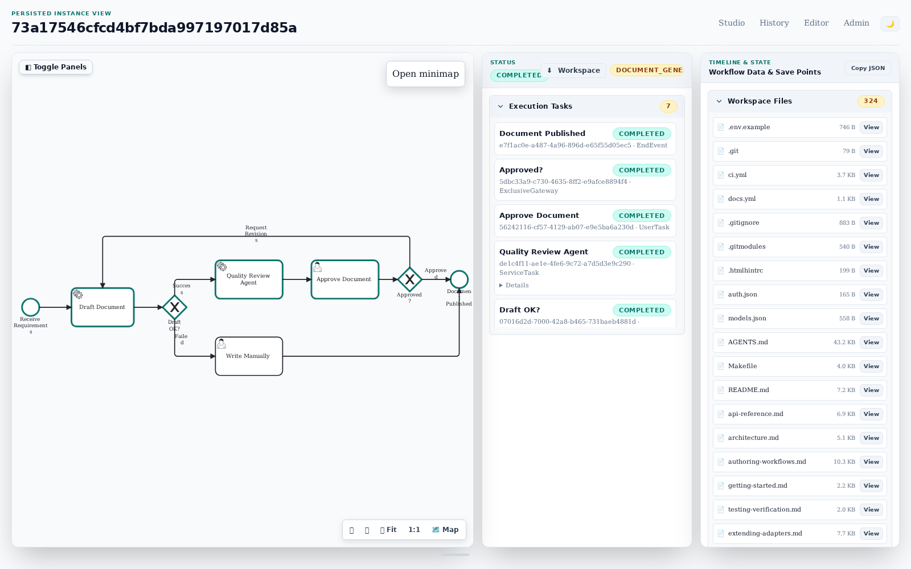
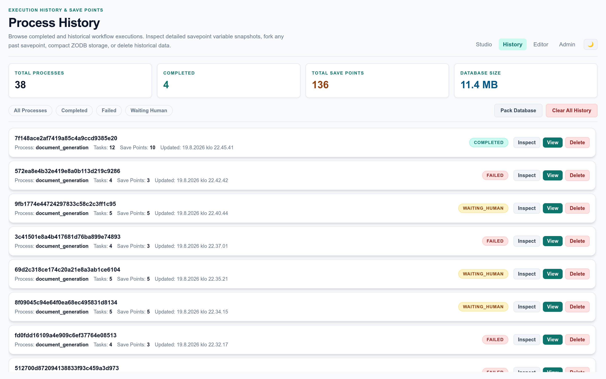
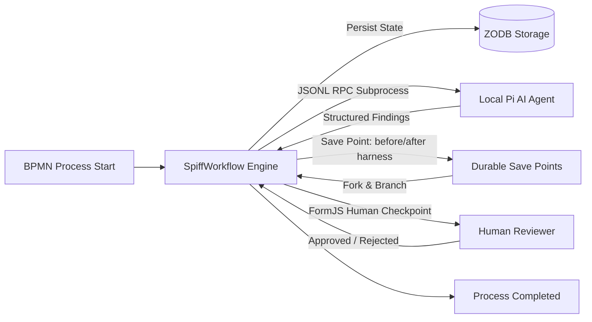

# Pi Workflow Studio

**Pi Workflow Studio** is a durable orchestration system pairing **BPMN 2.0 executable workflows** (powered by [SpiffWorkflow](https://github.com/sartography/SpiffWorkflow)) with **autonomous local AI agents** (powered by the Pi RPC architecture), **ACID-compliant ZODB persistence**, **durable save points**, and **FormJS human review checkpoints**.

---

## Visual Studio Tour

### 1. Studio Dashboard
The primary launchpad to select BPMN process templates, trigger new workflow executions, and monitor active review checkpoints.

### 2. Live Diagram & Human Review Checkpoint
Interactive BPMN diagram visualizer highlighting active execution nodes alongside dynamic human review forms with live Markdown previews powered by `@bpmn-io/form-js`.

### 3. Iterative Revision Loop & Workflow Completion
Full execution trace with color-coded completed task markers, iteration loops, variable state, and point-in-time save points.

### 4. Process History & Analytics
Comprehensive execution history with live metric counters, duration benchmarks, and status filters.

### 5. Save Point & Variable Inspector
Visual audit trail of all intermediate save points allowing inspection of variable payloads, workspace archives, and one-click timeline forking.

---

## Core Capabilities

- **Executable BPMN 2.0 Processes**: Industrial-grade business process orchestration with conditional gateways, service tasks, and user tasks.
- **Local Pi AI Agent Integration**: Robust JSONL RPC protocol execution with JSON schema validation, automatic fallback demo mode, and proxy-based secret injection.
- **ZODB ACID Durability**: Safe file-backed database (`data/workflows.fs`) or memory storage guaranteeing zero state loss across process restarts.
- **Save Points & Timeline Forking**: Automatic snapshotting at critical execution boundaries (`before_harness`, `after_harness`, `human_wait`) enabling state rewinds and parallel what-if branches.
- **FormJS Human Review Checkpoints**: Rich form rendering with dynamic field validation, allowing human operators to inspect AI findings and submit continuation decisions.
- **History & Data Lifecycle**: Full execution auditing, status filtering, variable payload inspection, and direct historical record removal.

---

## Quick Navigation

- [End-to-End Usage Story & Live Walkthrough](usage-story.md)
- [BPMN Orchestration & ZODB](features/orchestration.md)
- [Pi AI Agent Integration](features/ai-agent-integration.md)
- [Save Points & Timeline Forking](features/savepoints-forking.md)
- [Web Interface & FormJS](features/web-ui.md)
- [Process History & Analytics](features/history-analytics.md)
- [Developer & Getting Started Guide](development/getting-started.md)
- [Testing & Screenshot Automation](development/testing-verification.md)
