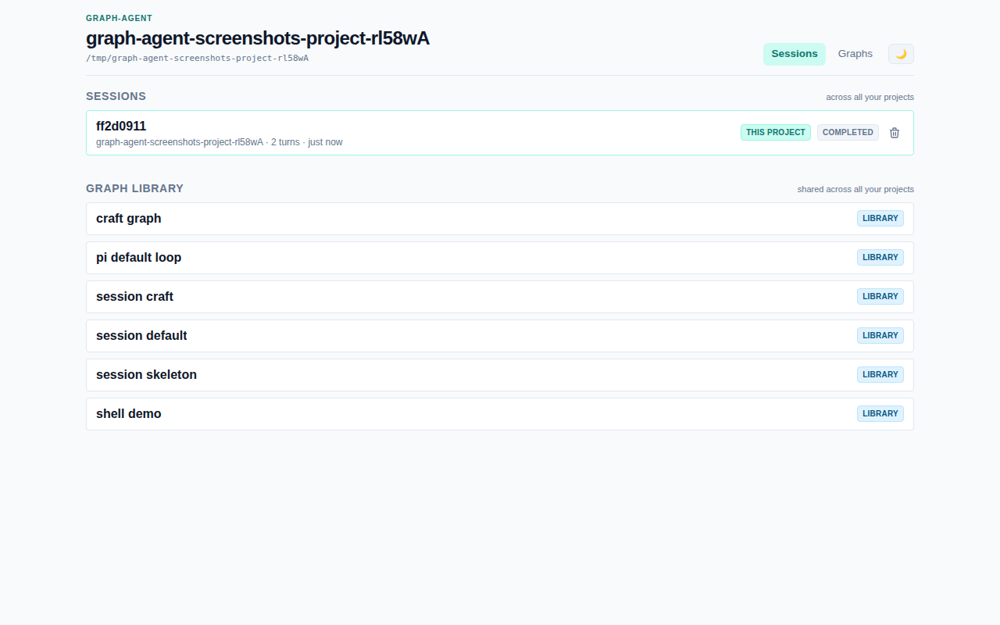
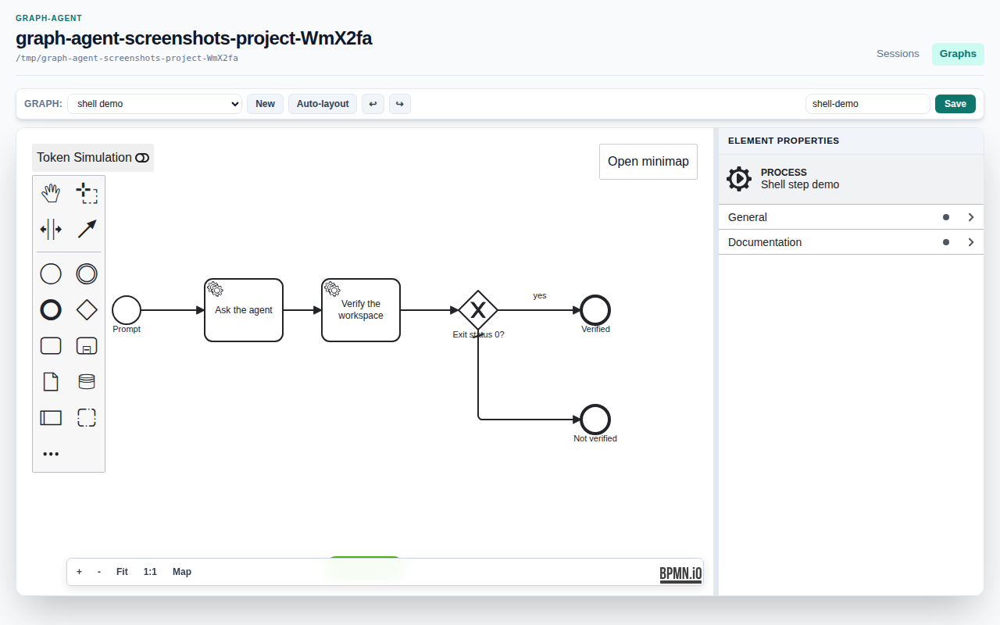
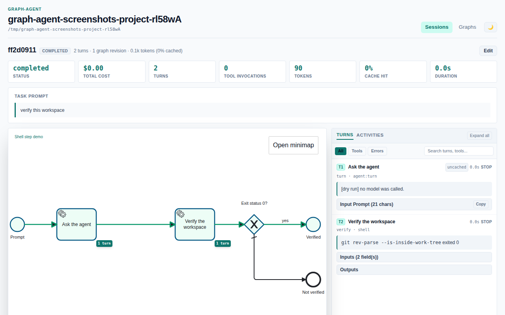

# graph-agent

A Pi coding agent whose control flow is a mutable Camunda-8-flavour BPMN graph.

The loop that drives the agent -- when to call the model, when to run a tool,
when to stop -- is not code you have to read to change. It is a diagram,
executed by [`bpmn-engine`](https://github.com/paed01/bpmn-engine), that the
agent itself can extend mid-session by splicing in new elements. Every
activity in the diagram dispatches to a **harness**: a small piece of
TypeScript that actually does the work an activity names.

- [Getting started](getting-started.html) -- build the project, run the bundled
  Pi demo loop, pair it with a deterministic `shell` step, point it at a real
  model, and read a run that went wrong.
- [Harness reference](harnesses.html) -- every job type a graph can dispatch to,
  and what it expects on the activity.

The CLI drives all four bundled graphs against a real model, tool calls and
parallel batches included -- and `craft-graph` really does splice new elements
into the session it is running in, approval gate and all. One caveat worth
knowing before you approve a fragment: `graph:lint` rejects a new activity
whose job type names no harness, but not one whose job type is real and wired
wrong, so a splice can still be inert until you run it (see [reviewing an
approved fragment](getting-started.html#review-an-approved-fragment-yourself)).

## Screenshots

The studio -- `graph-agent studio` -- is a BPMN editor and a session viewer for
whatever project you point it at.

These are not mockups -- `scripts/screenshot-docs.mjs` drives the real CLI and
a real Chromium against a throwaway workspace to produce them. Run
`node scripts/screenshot-docs.mjs` after any studio change to refresh them.
