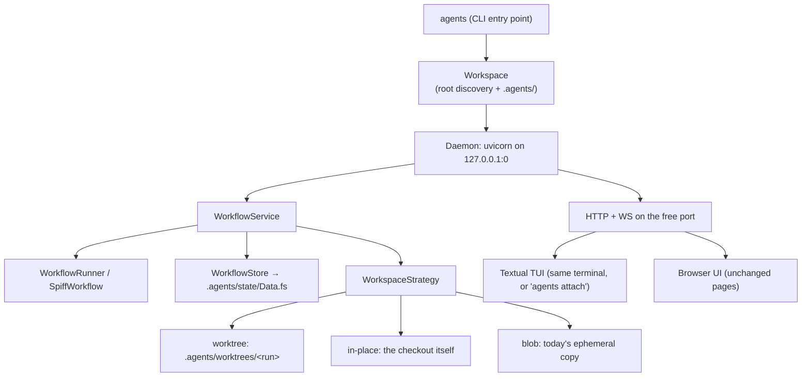

# Meta Agent Refactor — Plan

> Status: **proposal**. Nothing below is implemented yet. This document is the design
> record for turning the shared, long-running BPMN service into a per-workspace *meta
> agent*: a single binary you run inside a project, the way you run any other coding
> agent, that drives several long-running BPMN graphs against that project in parallel.

---

## 1. What changes, in one paragraph

Today this is a **server**: `uvicorn app.api.server:app` on a fixed `0.0.0.0:8000`, with
ZODB at `data/workflows.fs` relative to whatever directory it was started in, BPMN
templates globbed from `./workflows`, static assets read from `../node_modules`, and each
workflow instance executing in a throwaway `tempfile.mkdtemp()` workspace that is packed
into a ZODB blob after every turn. It is one installation serving many projects, and the
projects it serves are only ever seeded copies — the agent never touches your actual
checkout.

The target is a **tool**: `agents` (working name), installed once, run inside a project.
It finds the workspace root, opens `.agents/` for all state, binds a web server to a free
loopback port, and puts up a TUI in the terminal you launched it from. Long-running graphs
run in parallel against *that* workspace — a git worktree per run by default, so parallel
runs stay isolated and merge back through ordinary git — rather than against blob-shaped
copies of nothing.

---

## 2. Current state: what actually pins the code to "shared service"

Concrete, verified points of coupling. Each is a work item later in the plan.

| Coupling | Where | Notes |
|---|---|---|
| Fixed public bind | `app/main.py`, `devenv.nix` `processes.api`, `Makefile` `run`/`watch` | `0.0.0.0:8000`, hard-coded |
| App built at import time | `app/api/server.py:105` — `app = create_app()` | Binds CWD and env before any CLI can configure anything |
| ZODB path is CWD-relative | `WorkflowStore.__init__(path="data/workflows.fs")` (`app/persistence.py:330`) | `data/` is gitignored at repo root; there is no per-workspace notion |
| Remote/shared storage | `ZEO_ADDRESS` branch in `_create_storage` | Exists precisely because the store is meant to be shared |
| Templates are repo-relative | `WorkflowRegistry(workflows_dir="workflows")` | Plus `engine.load_workflow` globs `Path(bpmn_path).parent/*.bpmn` to resolve CallActivity targets — the *sibling directory* is the resolution root |
| Repo-root-relative assets | `server.py:83-85` (`parents[2]/node_modules`), `shell_adapter.py:23` (`parents[2]/workspace_templates`), `sandbox_policy.py:19` (`REPO_ROOT`), `pi_client.py:229,259` (`parents[1]`, `scripts/pi-demo`) | All assume "running from a checkout of this repo" |
| Not installable | `pyproject.toml` has no `[build-system]`, no `[project.scripts]`, and the top-level package is named `app` | There is no way to `pip install` this today |
| Multi-tenant auth | `ADMIN_TOKEN` + `API_KEYS` CSV → `ADMIN`/`OPERATOR`/`VIEWER` (`app/auth.py`) | Designed for a service several people reach |
| Multi-project API | `ProjectService` + `/project` router | "Which project?" is a runtime question today; it becomes a launch-time answer |
| Ephemeral, copied workspaces | `jobs.run_pi` → `unpack_workspace()` → adapter → `pack_workspace_to_bytes()` → `store.set_workspace(...)`; seeded from `PI_WORKDIR` | The agent never sees a real checkout |
| Config scattered across `os.getenv` | ~25 call sites across 12 modules | No single place a workspace can override |

Two things worth noting because they mean the plan is smaller than it looks:

- **The concurrency skeleton already exists.** `WorkflowService.jobs` holds the running
  `asyncio.Task` per turn, `dispatch()` fans out READY tasks, `shutdown()` cancels and
  awaits them, and `recover_orphaned_workflows()` runs at startup. Parallel graphs need a
  *bound* and a *lock discipline*, not a new engine.
- **The workspace direction is already written down.** `WorkspaceConflictError`'s docstring
  (`app/persistence.py:28`) names the git-worktree model as the intended fix for two
  concurrent turns sharing one workspace, and explicitly says it is not yet designed.
  Section 5 designs it.

---

## 3. Target shape

```
$ cd ~/src/my-project
$ agents                      # start-or-attach daemon, then open the TUI
  meta agent · my-project · http://127.0.0.1:41783
```

One process, three faces over one service layer:



The TUI is **not** a second entry into the service layer. It is an HTTP/WebSocket client
against the local daemon, exactly like the browser UI. One protocol, one auth path, and
`agents attach` from a second terminal works for free.

### `.agents/` layout

```
.agents/
  config.toml            # workspace settings: provider, model, defaults, parallelism   [commit]
  workflows/*.bpmn       # this workspace's graphs, materialised by `agents init`       [commit]
  .gitignore             # ignores everything below except config.toml + workflows/     [commit]
  state/
    Data.fs{,.index,.lock,.tmp}
    blobs/
  runtime.json           # pid, port, url, token, schema version of the live daemon
  worktrees/<run-id>/    # git worktrees, one per run (worktree strategy)
  runs/<run-id>/         # per-run scratch: prompts, raw adapter output, artifacts
  logs/agents.log
```

`config.toml` and `workflows/` are meant to be committed — a project's graphs are part of
the project. Everything else is machine state and is ignored by the `.gitignore` the tool
writes on `agents init`.

---

## 4. Phases

Each phase is independently shippable and leaves the test suite green. Phases 0–2 are
plumbing with no behavioural change; phase 3 is the one with real design risk.

### Phase 0 — Make the package installable and location-independent

*No behaviour change. This is the phase that makes every later phase possible.*

1. `git mv app metaagent` + mechanical import rewrite. The top-level name `app` cannot ship
   on PyPI or coexist in a site-packages with anything else. Doing it first keeps it a pure
   rename diff instead of tangling with logic changes later.
2. Add `[build-system]` (hatchling) and `[project.scripts] agents = "metaagent.cli:main"`.
3. Delete the module-level `app = create_app()`. `create_app(settings: Settings)` becomes
   the only constructor; `Settings` is passed in, never read from the environment inside
   the factory.
4. New `metaagent/config.py`: a `Settings` dataclass that layers **defaults → `.agents/config.toml`
   → environment → CLI flags**, absorbing the ~25 scattered `os.getenv` calls. Adapters keep
   reading a settings object, not `os.environ`.
5. Vendor the runtime assets into package data so nothing resolves through `parents[2]`:
   - `npm run build` copies `bpmn-js` / `@bpmn-io/form-js` dist into `metaagent/static/vendor/`.
   - `workspace_templates/` and `scripts/pi-demo` move under `metaagent/` as package data;
     `shell_adapter.TEMPLATE_ROOT` and `pi_client`'s demo path resolve via
     `importlib.resources`.
   - `sandbox_policy.REPO_ROOT` splits into two distinct things it currently conflates: the
     *package's* bundled policy templates, and the *vendored agent-sandbox checkout* (which
     stays a developer-machine concern, resolved from settings).

**Done when:** `uv build && pipx install dist/*.whl && cd /tmp/anything && agents --help`
works, and `pytest` is green.

### Phase 1 — `.agents/` as the state root

1. New `metaagent/workspace.py` (`Workspace`): root discovery — walk up from CWD for
   `.agents/`, then for `.git/`, else use CWD; `--workspace PATH` overrides. Owns the
   directory layout above and creates it lazily.
2. `WorkflowStore` is constructed with `workspace.state_dir / "Data.fs"`. **Drop the ZEO
   branch** — a per-workspace store has no remote to share with, and keeping it means
   keeping a `blob_dir="data/blobs"` hard-coding that contradicts the whole plan.
3. `agents init` materialises the bundled BPMN templates into `.agents/workflows/`.
   *This is deliberate, not laziness:* `engine.load_workflow` resolves CallActivity targets
   by globbing the BPMN file's own sibling directory, so a two-root registry (bundled +
   workspace) would silently break `composed_delivery.bpmn`-style composition across roots.
   One materialised root keeps that machinery untouched and makes the graphs editable —
   which is the point of a meta agent: you evolve your own pipeline.
4. `record["bpmn_path"]` is persisted **workspace-relative** and resolved at load, so a
   workspace survives being moved or cloned. Add a `migrations.py` step rewriting absolute
   paths that live under the workspace root.
5. Friendly single-daemon guard: an OS-level lock on `.agents/state`. A second `agents`
   invocation reads `runtime.json` and attaches rather than crashing on ZODB's
   `FileStorage` lock.

**Done when:** two different projects each hold their own independent history, and
`rm -rf .agents` is a clean reset.

### Phase 2 — Free-port daemon and the runtime handshake

1. `agents serve`: create the socket ourselves — `socket.bind(("127.0.0.1", 0))` — read
   `getsockname()[1]`, pass it to `uvicorn.Server.serve(sockets=[sock])`. Binding first and
   reporting after is what makes the port genuinely free rather than probe-then-race.
2. Write `.agents/runtime.json` atomically: `{schema, pid, port, url, token, started_at}`.
   Remove on clean exit; on startup treat an existing file as stale unless the pid is alive
   *and* the port answers `/health` with a matching token.
3. Auth collapses to a per-daemon random bearer token. `ADMIN_TOKEN`/`API_KEYS` and the
   role enum stay (webhooks and CI still want them) but the loopback token is minted at
   start and grants `ADMIN`. Add an `Origin`/`Host` check so a page on another origin can't
   drive the daemon through the browser.
4. `agents status` prints the URL; `agents open` launches a browser; `agents stop` shuts the
   daemon down.

**Done when:** two projects run simultaneously on different ports without any configuration.

### Phase 3 — Workspace execution strategies *(the crux)*

This is where "runs against the workspace where it was launched" collides with "savepoints
carry an independent copy of the workspace" and with "several graphs at once". A single
strategy cannot satisfy all three, so make it an interface with three implementations and a
per-template choice.

```python
class WorkspaceStrategy(Protocol):
    async def acquire(self, run_id: str) -> Path: ...        # a directory a turn may run in
    async def release(self, run_id: str) -> None: ...
    async def snapshot(self, run_id: str, label: str) -> str | None: ...   # savepoint ref
    async def restore(self, ref: str, into_run: str) -> Path: ...          # fork
    async def discard(self, run_id: str) -> None: ...
```

**`WorktreeStrategy` — the default when the workspace is a git repo.**
`git worktree add .agents/worktrees/<run-id> -b agents/run/<run-id>` off the current HEAD.
Each run gets a real, isolated checkout of the real project. A savepoint is a commit on that
run branch, so `snapshot` is `git commit --allow-empty -m "<label>"` and `restore` is a new
worktree at that commit — **fork becomes a branch, which is what it always wanted to be**.
Merging back is an ordinary `git merge` / PR that the user drives (`agents merge <run>`),
not something the engine does behind their back. Parallel runs are trivially safe.

**`InPlaceStrategy` — opt-in via `--in-place`, and the only option in a non-git directory.**
The launch directory itself. A per-workspace async mutex serialises *turns*, so parallel
graphs still park, think, and wait for humans concurrently, but only one harness has the
tree at a time. `snapshot` returns `None` and savepoints record graph state only; the fork
endpoint returns a clear 409 explaining that workspace restore is unavailable in this mode.
This is the mode that matches "similar to running a traditional agent" most literally, and
it is honest about what it gives up.

**`BlobStrategy` — today's behaviour, retained.**
Templates that scaffold from nothing (`beamer_slides.bpmn` and its `template="beamer"`
step) genuinely want an empty directory, not your checkout. Keeping this preserves the
existing feature set, the existing fork semantics, and the existing tests instead of
deleting a working capability to make a point.

Selection: `camunda:property name="workspace_mode"` on the process, falling back to
`config.toml`'s `default_workspace_mode`, falling back to worktree-if-git-else-in-place.

Consequences to handle in this phase:
- `jobs.run_pi`'s unpack/pack pair becomes `strategy.acquire()` / `strategy.snapshot()`.
- `WorkspaceConflictError` becomes strategy-local: worktree needs none, in-place uses the
  mutex, blob keeps the current version check.
- **Security posture changes and must be stated loudly in the docs.** Under in-place, and
  under worktree once merged, an agent turn writes files the user actually keeps.
  `SandboxPiAdapter`'s `--workspace` mount now points at real work. Mitigations: worktree by
  default, `--in-place` requires an explicit flag, and `.agents/` is excluded from every
  workspace the adapter is handed.

### Phase 4 — Parallel long-running runs

1. Bound the fan-out: an `asyncio.Semaphore(settings.max_parallel_turns)` around harness
   execution in `jobs.dispatch`, so ten graphs don't launch ten Pi subprocesses at once.
   Long-running graphs *waiting* are unbounded; only concurrent *turns* are capped.
2. Restart durability: on daemon start, `recover_orphaned_workflows()` already exists —
   extend it to reclaim or prune worktrees for runs that no longer exist, and to re-park
   instances whose in-flight turn died with the previous process.
3. CLI verbs over the daemon API: `agents run <template> --var k=v`, `agents ls`,
   `agents show <run>`, `agents cancel <run>`, `agents logs <run> -f`, `agents merge <run>`.
4. Fold in the known background-job/TestClient hang documented in `pyproject.toml`'s
   `timeout` comment. The daemon needs a clean Ctrl-C anyway, and the fix is the same:
   a job registry whose entries are always awaited on shutdown, with the `to_thread`
   workers made cancellable rather than abandoned.

### Phase 5 — The TUI

Textual, running in the same process as the daemon by default, talking to it over
HTTP + `/ws/instance/{id}` on the loopback port.

| Screen | Purpose |
|---|---|
| **Runs** | Every graph, its status, current task, elapsed time. The default view. |
| **Run detail** | Task timeline for one graph + live streaming agent/shell output (the existing `shell_output` / agent event channel). |
| **Inbox** | Pending human tasks across *all* runs. This is the screen that makes parallel graphs actually usable — without it, N graphs means N places to look. |
| **Form** | Renders the FormJS subset natively (textfield, textarea, number, checkbox, select, radio). Anything richer shows a one-key "open in browser" deep link rather than a bad approximation. |
| **Start** | Template picker from `.agents/workflows/`, with variable prompts. |
| **Log** | Tail of `.agents/logs/agents.log`. |

`agents` with no arguments = start-or-attach + TUI. `agents attach` = TUI against an
already-running daemon. `agents serve --no-tui` = headless.

### Phase 6 — Prune the shared-service surface, rewrite the docs

- Collapse the multi-Project API: the workspace *is* the project. `ProjectService` becomes
  a thin projection over the single workspace Project (`workflows/project.bpmn` keeps its
  park-and-spawn shape, which is exactly right for a per-workspace supervisor); `/project`
  keeps working with an implicit slug.
- Retire the legacy `/admin/*` router in favour of `/api/history/*` + the CLI.
- Rewrite `README.md`, `AGENTS.md` (§ Architecture & Module Map, § 1 Serving, § 6
  Persistence), `docs/architecture.md`, `docs/development/getting-started.md`, and add
  `docs/meta-agent.md`. Keep `devenv.nix` for *developing this tool*, but it stops being how
  anyone runs it.

---

## 5. Decisions taken (and how to reverse them)

| # | Decision | Why | Reversal cost |
|---|---|---|---|
| 1 | Worktree is the default execution mode, in-place is opt-in | Parallel runs are a stated requirement, and worktrees give isolation + fork + merge with no invented machinery | Config default flip |
| 2 | Bundled templates are *materialised* into `.agents/workflows/`, not read from package data | CallActivity resolution globs the BPMN file's sibling directory; a two-root registry breaks composition | Low, but re-breaks composition |
| 3 | TUI speaks HTTP to the local daemon, never the service layer directly | One protocol, one auth path, `attach` for free | Medium — would fork the code paths |
| 4 | ZEO is removed | Contradicts per-workspace state; keeps a hard-coded `data/blobs` | Re-add as a settings branch |
| 5 | The web UI stays first-class, unchanged | It already does the things a TUI does badly: the BPMN diagram, rich FormJS, savepoint inspector | — |
| 6 | One daemon per workspace | Simpler lifecycle, matches `.agents/runtime.json`, no cross-project blast radius | Large — would need a registry daemon |

## 6. Open questions for you

1. **CLI and package name.** This plan writes `agents` / `metaagent` throughout to be
   concrete. Say the word and it becomes anything else — it is a sed away in phase 0 and
   expensive after.
2. **Non-git workspaces.** Does `agents` need to work in a directory that isn't a git repo?
   If yes, `InPlaceStrategy` is load-bearing rather than an escape hatch, and phase 3 grows
   the "savepoints without workspace restore" UX (banner in the UI, disabled fork buttons).
3. **Merge-back.** Is `agents merge <run>` (engine fast-forwards or merges the run branch)
   in scope, or does the run just leave a branch for the user to handle? Plan assumes the
   latter, with `merge` as sugar.
4. **Does the browser UI survive long-term?** Keeping it means keeping the whole
   TypeScript/esbuild/Tailwind pipeline and the vendored bpmn-js submodules in the installed
   package (~tens of MB). Dropping it later would shrink the install substantially but costs
   the diagram view.

## 7. Sequencing summary

```
Phase 0  installable package, no repo-relative paths, Settings object      [no behaviour change]
Phase 1  .agents/ state root, workspace discovery, ZEO dropped             [no behaviour change]
Phase 2  free-port daemon, runtime.json, loopback token                    [no behaviour change]
Phase 3  WorkspaceStrategy: worktree | in-place | blob                     ← design risk lives here
Phase 4  bounded parallelism, restart durability, CLI run verbs
Phase 5  Textual TUI over the daemon API
Phase 6  prune shared-service surface, rewrite docs
```

Phases 0–2 are safe to land before phase 3's design is settled, and they are the majority
of the mechanical work. If the answers in § 6 change phase 3, nothing earlier is wasted.
