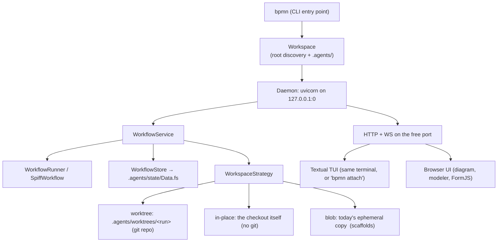

# Meta Agent Refactor — Plan

> Status: **proposal**, decisions settled. Nothing below is implemented yet. This document
> is the design record for turning the shared, long-running BPMN service into a
> per-workspace *meta agent*: a single command you run inside a project, the way you run
> any other coding agent, that drives several long-running BPMN graphs against that
> project in parallel.
>
> Tracked on [PR #6](https://github.com/datakurre/bpmn-iteration-playground/pull/6).

---

## 1. What changes, in one paragraph

Today this is a **server**: `uvicorn app.api.server:app` on a fixed `0.0.0.0:8000`, with
ZODB at `data/workflows.fs` relative to whatever directory it was started in, BPMN
templates globbed from `./workflows`, static assets read from `../node_modules`, and each
workflow instance executing in a throwaway `tempfile.mkdtemp()` workspace that is packed
into a ZODB blob after every turn. It is one installation serving many projects, and the
projects it serves are only ever seeded copies — the agent never touches your actual
checkout.

The target is a **tool**: `bpmn`, installed once, run inside a project. It finds the
workspace root, opens `.agents/` for all state, binds a web server to a free loopback
port, and puts up a TUI in the terminal you launched it from. Long-running graphs run in
parallel against *that* workspace — a git worktree per run where the workspace is a git
repo, in place where it isn't.

---

## 2. Settled decisions

These four were open; they are now answered, and the rest of the plan is written around
them.

| Decision | Answer | Consequence |
|---|---|---|
| CLI + package name | **`bpmn`** / `bpmn_agent` | Names the tool after what distinguishes it: BPMN graphs as the controller. The state directory stays `.agents/` as specified — the slight mismatch is deliberate, since `.agents/` is the name that reads right next to a project's other agent config |
| Non-git workspaces | **Must work anywhere** | `InPlaceStrategy` is first-class, not an escape hatch. Phase 3 grows a degraded-mode UX across API, web, and TUI |
| Merge-back | **Auto-merge on clean completion** | Successful runs land on the base branch without asking. § 6 designs the guard rails this needs |
| Browser UI | **Stays first-class** | The esbuild/Tailwind pipeline and vendored bpmn-js ship inside the wheel; phase 0 must vendor them properly |

---

## 3. Current state: what actually pins the code to "shared service"

Concrete, verified points of coupling. Each is a work item later in the plan.

| Coupling | Where | Notes |
|---|---|---|
| Fixed public bind | `app/main.py`, `devenv.nix` `processes.api`, `Makefile` `run`/`watch` | `0.0.0.0:8000`, hard-coded |
| App built at import time | `app/api/server.py:105` — `app = create_app()` | Binds CWD and env before any CLI can configure anything |
| ZODB path is CWD-relative | `WorkflowStore.__init__(path="data/workflows.fs")` (`app/persistence.py:330`) | `data/` is gitignored at repo root; there is no per-workspace notion |
| Remote/shared storage | `ZEO_ADDRESS` branch in `_create_storage` | Exists precisely because the store is meant to be shared |
| Templates are repo-relative | `WorkflowRegistry(workflows_dir="workflows")` | Plus `engine.load_workflow` globs `Path(bpmn_path).parent/*.bpmn` to resolve CallActivity targets — the *sibling directory* is the resolution root |
| Repo-root-relative assets | `server.py:83-85` (`parents[2]/node_modules`), `shell_adapter.py:23` (`parents[2]/workspace_templates`), `sandbox_policy.py:19` (`REPO_ROOT`), `pi_client.py:229,259` (`parents[1]`, `scripts/pi-demo`) | All assume "running from a checkout of this repo" |
| Not installable | `pyproject.toml` has no `[build-system]`, no `[project.scripts]`, and the top-level package is named `app` | There is no way to `pip install` this today |
| Multi-tenant auth | `ADMIN_TOKEN` + `API_KEYS` CSV → `ADMIN`/`OPERATOR`/`VIEWER` (`app/auth.py`) | Designed for a service several people reach |
| Multi-project API | `ProjectService` + `/project` router | "Which project?" is a runtime question today; it becomes a launch-time answer |
| Ephemeral, copied workspaces | `jobs.run_pi` → `unpack_workspace()` → adapter → `pack_workspace_to_bytes()` → `store.set_workspace(...)`; seeded from `PI_WORKDIR` | The agent never sees a real checkout |
| Config scattered across `os.getenv` | ~25 call sites across 12 modules | No single place a workspace can override |

Two things worth noting because they mean the plan is smaller than it looks:

- **The concurrency skeleton already exists.** `WorkflowService.jobs` holds the running
  `asyncio.Task` per turn, `dispatch()` fans out READY tasks, `shutdown()` cancels and
  awaits them, and `recover_orphaned_workflows()` runs at startup. Parallel graphs need a
  *bound* and a *lock discipline*, not a new engine.
- **The workspace direction is already written down.** `WorkspaceConflictError`'s docstring
  (`app/persistence.py:28`) names the git-worktree model as the intended fix for two
  concurrent turns sharing one workspace, and explicitly says it is not yet designed.
  Section 5 designs it.

---

## 4. Target shape

```
$ cd ~/src/my-project
$ bpmn                        # start-or-attach daemon, then open the TUI
  bpmn agent · my-project · http://127.0.0.1:41783
```

One process, three faces over one service layer:



The TUI is **not** a second entry into the service layer. It is an HTTP/WebSocket client
against the local daemon, exactly like the browser UI. One protocol, one auth path, and
`bpmn attach` from a second terminal works for free.

### `.agents/` layout

```
.agents/
  config.toml            # workspace settings: provider, model, defaults, parallelism   [commit]
  workflows/*.bpmn       # this workspace's graphs, materialised by `bpmn init`         [commit]
  .gitignore             # ignores everything below except config.toml + workflows/     [commit]
  state/
    Data.fs{,.index,.lock,.tmp}
    blobs/
  runtime.json           # pid, port, url, token, schema version of the live daemon
  worktrees/<run-id>/    # git worktrees, one per run (worktree strategy)
  runs/<run-id>/         # per-run scratch: prompts, raw adapter output, artifacts
  logs/bpmn-agent.log
```

`config.toml` and `workflows/` are meant to be committed — a project's graphs are part of
the project. Everything else is machine state, ignored by the `.gitignore` the tool writes
on `bpmn init`. In a non-git workspace the `.gitignore` is still written (harmless, and
correct the moment someone runs `git init` later).

---

## 5. Phases

Each phase is independently shippable and leaves the test suite green. Phases 0–2 are
plumbing with no behavioural change; phase 3 is the one with real design risk.

### Phase 0 — Make the package installable and location-independent

*No behaviour change. This is the phase that makes every later phase possible.*

1. `git mv app bpmn_agent` + mechanical import rewrite. The top-level name `app` cannot ship
   on PyPI or coexist in a site-packages with anything else. Doing it first keeps it a pure
   rename diff instead of tangling with logic changes later.
2. Add `[build-system]` (hatchling) and `[project.scripts] bpmn = "bpmn_agent.cli:main"`.
3. Delete the module-level `app = create_app()`. `create_app(settings: Settings)` becomes
   the only constructor; `Settings` is passed in, never read from the environment inside
   the factory.
4. New `bpmn_agent/config.py`: a `Settings` dataclass that layers **defaults → `.agents/config.toml`
   → environment → CLI flags**, absorbing the ~25 scattered `os.getenv` calls. Adapters keep
   reading a settings object, not `os.environ`.
5. Vendor the runtime assets into package data so nothing resolves through `parents[2]`.
   The browser UI stays first-class, so this has to be done properly rather than trimmed:
   - `npm run build` copies `bpmn-js` / `@bpmn-io/form-js` dist into `bpmn_agent/static/vendor/`,
     and the built `pages/`, modeler and viewer bundles ship as package data too.
   - The vendored `operaton-element-templates` submodules are a **build-time** dependency:
     their `dist/` output is bundled by esbuild into the modeler bundle, so the wheel ships
     the bundle, not the submodules. Wheel size lands in the tens of MB, which was the
     accepted cost of keeping the diagram view.
   - `workspace_templates/` and `scripts/pi-demo` move under `bpmn_agent/` as package data;
     `shell_adapter.TEMPLATE_ROOT` and `pi_client`'s demo path resolve via
     `importlib.resources`.
   - `sandbox_policy.REPO_ROOT` splits into two distinct things it currently conflates: the
     *package's* bundled policy templates, and the *vendored agent-sandbox checkout* (which
     stays a developer-machine concern, resolved from settings).
6. A wheel-build smoke test in CI: build, install into a clean venv, run `bpmn --help` and
   `bpmn init` in a temp directory, assert the static assets resolve. Package-data bugs are
   invisible from a source checkout and this is the only thing that catches them.

**Done when:** `uv build && pipx install dist/*.whl && cd /tmp/anything && bpmn --help`
works, and `pytest` is green.

### Phase 1 — `.agents/` as the state root

1. New `bpmn_agent/workspace.py` (`Workspace`): root discovery — walk up from CWD for
   `.agents/`, then for `.git/`, else use CWD; `--workspace PATH` overrides. Owns the
   directory layout above and creates it lazily. Records `is_git` at discovery, which is
   what phase 3 selects a strategy on.
2. `WorkflowStore` is constructed with `workspace.state_dir / "Data.fs"`. **Drop the ZEO
   branch** — a per-workspace store has no remote to share with, and keeping it means
   keeping a `blob_dir="data/blobs"` hard-coding that contradicts the whole plan.
3. `bpmn init` materialises the bundled BPMN templates into `.agents/workflows/`.
   *This is deliberate, not laziness:* `engine.load_workflow` resolves CallActivity targets
   by globbing the BPMN file's own sibling directory, so a two-root registry (bundled +
   workspace) would silently break `composed_delivery.bpmn`-style composition across roots.
   One materialised root keeps that machinery untouched and makes the graphs editable —
   which is the point of a meta agent: you evolve your own pipeline.
4. `record["bpmn_path"]` is persisted **workspace-relative** and resolved at load, so a
   workspace survives being moved or cloned. Add a `migrations.py` step rewriting absolute
   paths that live under the workspace root.
5. Friendly single-daemon guard: an OS-level lock on `.agents/state`. A second `bpmn`
   invocation reads `runtime.json` and attaches rather than crashing on ZODB's
   `FileStorage` lock.

**Done when:** two different projects each hold their own independent history, and
`rm -rf .agents` is a clean reset.

### Phase 2 — Free-port daemon and the runtime handshake

1. `bpmn serve`: create the socket ourselves — `socket.bind(("127.0.0.1", 0))` — read
   `getsockname()[1]`, pass it to `uvicorn.Server.serve(sockets=[sock])`. Binding first and
   reporting after is what makes the port genuinely free rather than probe-then-race.
2. Write `.agents/runtime.json` atomically: `{schema, pid, port, url, token, started_at}`.
   Remove on clean exit; on startup treat an existing file as stale unless the pid is alive
   *and* the port answers `/health` with a matching token.
3. Auth collapses to a per-daemon random bearer token. `ADMIN_TOKEN`/`API_KEYS` and the
   role enum stay (webhooks and CI still want them) but the loopback token is minted at
   start and grants `ADMIN`. Add an `Origin`/`Host` check so a page on another origin can't
   drive the daemon through the browser.
4. `bpmn status` prints the URL; `bpmn open` launches a browser; `bpmn stop` shuts the
   daemon down.

**Done when:** two projects run simultaneously on different ports without any configuration.

### Phase 3 — Workspace execution strategies *(the crux)*

This is where "runs against the workspace where it was launched" collides with "savepoints
carry an independent copy of the workspace" and with "several graphs at once". A single
strategy cannot satisfy all three, so make it an interface with three implementations.

```python
class WorkspaceStrategy(Protocol):
    supports_snapshot: bool                                  # drives fork UX everywhere
    async def acquire(self, run_id: str) -> Path: ...        # a directory a turn may run in
    async def release(self, run_id: str) -> None: ...
    async def snapshot(self, run_id: str, label: str) -> str | None: ...   # savepoint ref
    async def restore(self, ref: str, into_run: str) -> Path: ...          # fork
    async def discard(self, run_id: str) -> None: ...
```

**`WorktreeStrategy` — automatic when the workspace is a git repo.**
`git worktree add .agents/worktrees/<run-id> -b bpmn/run/<run-id>` off the current HEAD.
Each run gets a real, isolated checkout of the real project. A savepoint is a commit on that
run branch, so `snapshot` is `git commit --allow-empty -m "<label>"` and `restore` is a new
worktree at that commit — **fork becomes a branch, which is what it always wanted to be**.
Parallel runs are trivially safe. Merge-back is § 6.

**`InPlaceStrategy` — automatic when the workspace is not a git repo, or `--in-place`.**
The launch directory itself. This is now a **first-class mode**, not an escape hatch, so it
gets first-class treatment rather than a stub:

- A per-workspace async mutex serialises *turns*. Parallel graphs still park, think, and
  wait for humans concurrently, but only one harness holds the tree at a time. **State this
  plainly in the docs and in the TUI**: in a non-git workspace, "parallel runs" means
  parallel waiting, serialised working.
- `supports_snapshot = False`. Savepoints still record graph state — retry, resume, and the
  full execution history all keep working — they just carry no workspace copy.
- Degraded-mode UX, in all three surfaces:
  - **API**: `POST /instance/{id}/fork/{sp}` returns `409` with a typed body
    (`{"error": "workspace_snapshot_unsupported", "mode": "in_place", ...}`), not a bare
    string, so clients branch on it rather than parsing prose.
  - **Web**: the instance page renders fork controls disabled with a one-line explanation,
    and the savepoint inspector shows "graph state only" instead of an empty file list.
  - **TUI**: the same, and the run header carries a `IN-PLACE · SERIALISED` badge so nobody
    wonders why their second run isn't moving.
- `bpmn init` works in any directory and prints one line noting the mode and what it costs,
  with the `git init` suggestion — informational, never a prompt that blocks.

**`BlobStrategy` — today's behaviour, retained.**
Templates that scaffold from nothing (`beamer_slides.bpmn` and its `template="beamer"`
step) genuinely want an empty directory, not your checkout. Keeping this preserves the
existing feature set, the existing fork semantics, and the existing tests instead of
deleting a working capability to make a point.

Selection: `camunda:property name="workspace_mode"` on the process, falling back to
`config.toml`'s `default_workspace_mode`, falling back to **worktree if git, else in-place**.

Consequences to handle in this phase:
- `jobs.run_pi`'s unpack/pack pair becomes `strategy.acquire()` / `strategy.snapshot()`.
- `WorkspaceConflictError` becomes strategy-local: worktree needs none, in-place uses the
  mutex, blob keeps the current version check.
- **Security posture changes and must be stated loudly in the docs.** Under in-place, and
  under worktree once merged, an agent turn writes files the user actually keeps.
  `SandboxPiAdapter`'s `--workspace` mount now points at real work. Mitigations: worktree
  wherever git makes it possible, and `.agents/` excluded from every workspace an adapter is
  handed.

### Phase 4 — Parallel long-running runs

**Status: done (items 1–3; item 4 deferred).** See AGENTS.md §4e for the as-built
reference.

1. ~~Bound the fan-out~~ — done: `WorkflowService._harness_semaphore`
   (`asyncio.Semaphore(MAX_PARALLEL_TURNS)`, default 4) around `adapter.run()` in
   `orchestration/jobs.py`, exactly as scoped. Long-running graphs *waiting* stay
   unbounded; only concurrent *turns* are capped. Under in-place the workspace mutex
   further narrows this to one, independently of the semaphore.
2. ~~Restart durability~~ — done: `recover_orphaned_workflows()` now also calls
   `_reclaim_orphaned_worktrees()`, removing any `.agents/worktrees/<id>` with no
   matching instance record at all. A worktree whose instance record still exists,
   however stale, is left to the existing retry path, not this cleanup pass.
3. ~~CLI verbs over the daemon API~~ — done: `bpmn run/ls/show/cancel/logs/merge`, all a
   second `bpmn` invocation speaking HTTP to the daemon via the new `bpmn_agent/client.py`
   (`DaemonClient`), never touching the store or workspace directly. `bpmn merge` is
   manual-trigger only — see §6's "what shipped" note below.
4. The background-job/TestClient hang fold-in is **deferred**, not done in this pass: it's
   an orthogonal shutdown-cleanliness fix (a job registry awaited on Ctrl-C) rather than
   something the parallelism/CLI/merge work above depends on or blocks.

**A gap this phase's own smoke test surfaced, fixed in passing:** `bpmn_agent/api/server.py`
calls `configure_logging()` at import time, which without an explicit `LOG_FILE` writes to
a CWD-relative `bpmn_agent.log`. A genuine `bpmn serve` runs with CWD = `workspace.root`,
so that log file landed directly in the git-tracked tree — permanently dirty, permanently
failing `bpmn merge`'s clean-working-tree precondition on every real invocation. `_cmd_serve`
now sets `LOG_FILE` (via `setdefault`, so an operator's own value still wins) to
`.agents/logs/bpmn-agent.log` before importing `api.server`.

### Phase 5 — The TUI

Textual, running in the same process as the daemon by default, talking to it over
HTTP + `/ws/instance/{id}` on the loopback port.

| Screen | Purpose |
|---|---|
| **Runs** | Every graph, its status, current task, elapsed time, and merge state. The default view. |
| **Run detail** | Task timeline for one graph + live streaming agent/shell output (the existing `shell_output` / agent event channel). |
| **Inbox** | Pending human tasks *and* deferred merges across all runs. This is the screen that makes parallel graphs usable — without it, N graphs means N places to look. |
| **Form** | Renders the FormJS subset natively (textfield, textarea, number, checkbox, select, radio). Anything richer shows a one-key "open in browser" deep link rather than a bad approximation. |
| **Start** | Template picker from `.agents/workflows/`, with variable prompts. |
| **Log** | Tail of `.agents/logs/bpmn-agent.log`. |

`bpmn` with no arguments = start-or-attach + TUI. `bpmn attach` = TUI against an
already-running daemon. `bpmn serve --no-tui` = headless.

### Phase 6 — Prune the shared-service surface, rewrite the docs

- Collapse the multi-Project API: the workspace *is* the project. `ProjectService` becomes
  a thin projection over the single workspace Project (`workflows/project.bpmn` keeps its
  park-and-spawn shape, which is exactly right for a per-workspace supervisor); `/project`
  keeps working with an implicit slug.
- Retire the legacy `/admin/*` router in favour of `/api/history/*` + the CLI.
- Rewrite `README.md`, `AGENTS.md` (§ Architecture & Module Map, § 1 Serving, § 6
  Persistence), `docs/architecture.md`, `docs/development/getting-started.md`, and add
  `docs/meta-agent.md`. Keep `devenv.nix` for *developing this tool*, but it stops being how
  anyone runs it.

---

## 6. Auto-merge on clean completion

**What actually shipped in phase 4: `bpmn merge <run>` (manual trigger) only.** The
mechanics below — preconditions, `--no-ff`, deferred-not-forced failure, `merge_deferred`
state, the `run_merged`/`run_merge_deferred` events — are implemented as described, in
`WorktreeStrategy.merge` and `WorkflowService.merge`. The `merge_on_complete` auto-trigger,
its `config.toml` reader, the per-template `camunda:property` override, and `bpmn run
--no-merge` are **not built** — they need a `config.toml` reader this codebase doesn't have
yet, and are left for a later pass. Precondition 3 is also simplified from the general form
below: this codebase has one workspace root and therefore one checkout to merge into, so
"clean, or not the currently checked-out branch" collapses to "HEAD's working tree is
clean" (excluding `.agents/` itself via a git pathspec, since `ensure()` puts it directly
in `workspace.root` where it always shows up as untracked).

The decision is that a successful run lands on the base branch without being asked. That is
straightforward to build and genuinely reduces friction on long unattended pipelines. It
also means agent output reaches the branch you work on with no review gate — which is the
risk the worktree isolation exists to contain. The design below gives you the behaviour you
asked for while keeping every merge visible, bounded, and revertable in one command.

**Only worktree mode merges anything.** In-place has no branch and nothing to merge; blob
mode's workspace is a scratch copy nobody wants. Auto-merge is a `WorktreeStrategy` concern
exclusively.

**Preconditions, all required.** The merge is attempted only when:

1. the run reached `completed` — not cancelled, not failed, not parked;
2. the base branch still exists and is a descendant-or-equal of the commit the run forked
   from, or merges cleanly against it;
3. the base branch's working tree is **clean**, or the base branch is not the one currently
   checked out. This is the important one: you are editing that checkout while runs
   execute, and merging into a dirty tree is how a tool eats someone's uncommitted work.

**Mechanics.** `git merge --no-ff bpmn/run/<id>` into the base ref, with a merge commit
naming the run id, the template, and the number of turns. `--no-ff` is deliberate: every
auto-merge is exactly one commit, so `git revert -m 1 <sha>` undoes an entire run's output
in one step regardless of how many savepoint commits it made.

**Failure is deferred, never forced.** A conflict, a dirty tree, or a failed precondition
aborts the merge (`git merge --abort`), leaves the run branch intact, and moves the run to
a `merge_deferred` state that surfaces in the TUI **Inbox** and the web dashboard alongside
pending human tasks. `bpmn merge <run>` retries it manually. Nothing is ever forced, and no
conflict is ever resolved automatically.

**Escape hatches.** `merge_on_complete` in `config.toml` (default `true`, per this
decision), overridable per template via a `camunda:property` and per run via
`bpmn run --no-merge`. A `run_merged` event goes through the existing `EventBus`, so
webhooks and the TUI both see it.

**What this still costs, stated once.** Between a run completing and you next looking at
the repo, your branch may have moved. The mitigations above make that visible and
revertable; they do not make it reviewed. If that turns out to bite, flipping
`merge_on_complete` to `false` in `config.toml` restores review-before-merge with no code
change — which is why it is a setting rather than a hard-coded policy.

---

## 7. Decisions taken, and how to reverse them

| # | Decision | Why | Reversal cost |
|---|---|---|---|
| 1 | `bpmn` / `bpmn_agent`, state in `.agents/` | Names the tool after what distinguishes it; `.agents/` was specified and reads right beside other agent config | sed, during phase 0 only |
| 2 | Worktree where git allows it, in-place otherwise — both first-class | The tool must run in any directory; git is what makes isolation possible, not a requirement to use it | — |
| 3 | Auto-merge on clean completion, guarded per § 6 | Chosen; friction on unattended pipelines | `merge_on_complete = false` |
| 4 | The web UI stays first-class | It does what a TUI does badly: the diagram, the modeler, rich FormJS, the savepoint inspector | — |
| 5 | Bundled templates are *materialised* into `.agents/workflows/` | CallActivity resolution globs the BPMN file's sibling directory; a two-root registry breaks composition | Low, but re-breaks composition |
| 6 | TUI speaks HTTP to the local daemon, never the service layer directly | One protocol, one auth path, `attach` for free | Medium — would fork the code paths |
| 7 | ZEO is removed | Contradicts per-workspace state; keeps a hard-coded `data/blobs` | Re-add as a settings branch |
| 8 | One daemon per workspace | Simpler lifecycle, matches `.agents/runtime.json`, no cross-project blast radius | Large — would need a registry daemon |

---

## 8. Sequencing summary

```
Phase 0  installable package, no repo-relative paths, Settings object      [no behaviour change]
Phase 1  .agents/ state root, workspace discovery, ZEO dropped             [no behaviour change]
Phase 2  free-port daemon, runtime.json, loopback token                    [no behaviour change]
Phase 3  WorkspaceStrategy: worktree | in-place | blob  + degraded-mode UX ← design risk lives here
Phase 4  bounded parallelism, restart durability, CLI run verbs
Phase 5  Textual TUI over the daemon API
Phase 6  prune shared-service surface, rewrite docs
```

Phases 0–2 are behaviour-preserving and carry the bulk of the mechanical work. Phase 3 is
where the two consequential answers — non-git support and auto-merge — actually land, and
it is the phase worth reviewing before it is built.
