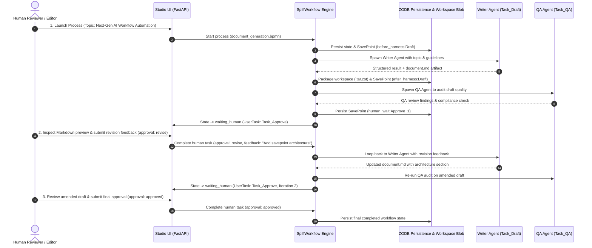
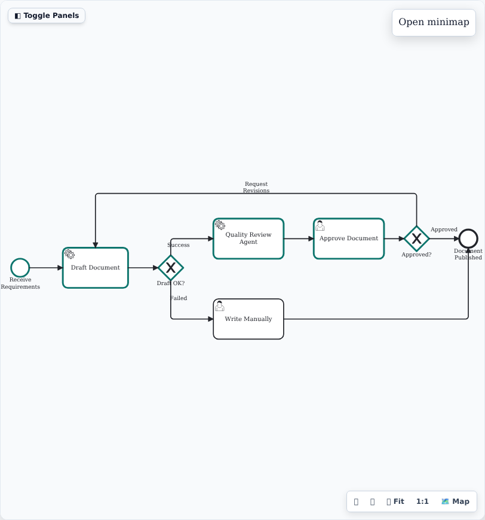
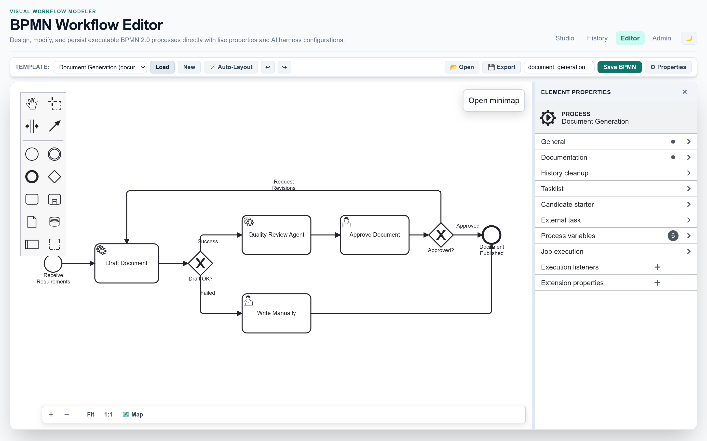
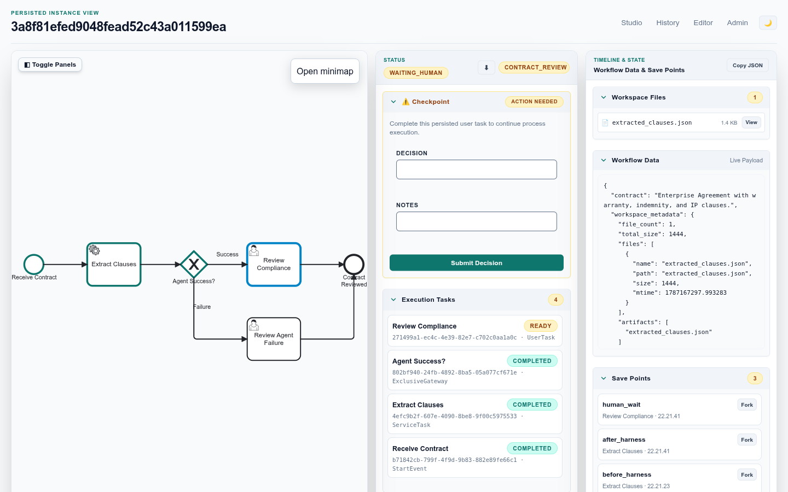
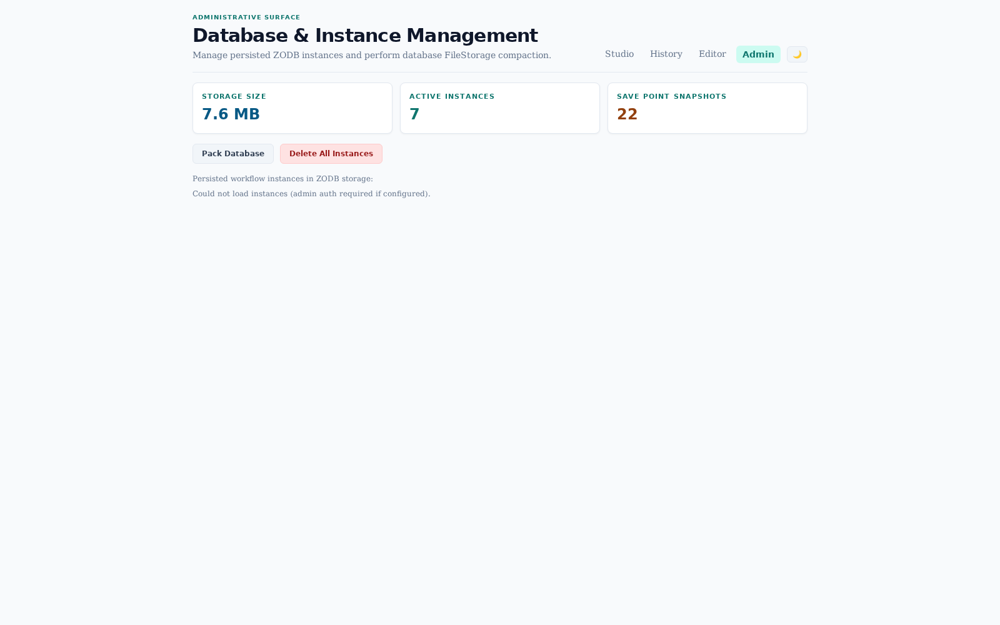

# End-to-End Usage Story: Iterative AI Document Generation & Human-in-the-Loop Review

This walkthrough follows a real-world document drafting and editorial review process executed in **Pi Workflow Studio**, orchestrating multi-stage autonomous AI agents powered by **OpenCode Zen / Pi Agent (`opencode-go`)**, durable **ZODB persistence**, **savepoint timeline forking**, **sandboxed workspace artifact packaging**, and interactive **FormJS human checkpoints with revision iteration**.

---

## The Workflow Scenario: Collaborative Document Generation

Technical writing and marketing teams orchestrate multi-agent collaboration with human oversight:
1. **Initial Draft (`Task_Draft`)**: A specialized Technical Writer AI agent drafts a technical whitepaper and packages `document.md` into the instance workspace.
2. **Quality & Fact-Check Review (`Task_QA`)**: An Editor AI agent audits the draft against factual consistency and style guidelines.
3. **Interactive Human Review (`Task_Approve`)**: A human reviewer inspects the generated Markdown preview, edits the draft text, and decides whether to approve or request changes.
4. **Revision Loop (`GW_Approve` → `Flow_Approve_Revise`)**: If changes are requested, the workflow automatically loops back to the Writer agent with structured feedback to re-draft the document.
5. **Final Approval & Publication (`Task_Publish` → `End_Doc`)**: Upon approval, the finalized document is published and persisted.



---

## Step-by-Step Walkthrough

### Step 1: Launch Process from Studio Dashboard

The **Studio Dashboard** serves as the operational hub where team members initiate workflows from registered templates and monitor active processes requiring action:


- **Template Selection**: Choose `bpmn_agent/data/workflows/document_generation.bpmn`.
- **Process Parameters**:
  ```json
  {
    "topic": "Next-Gen AI Workflow Automation with SpiffWorkflow & Pi Agent",
    "target_audience": "Software Architects & AI Engineers",
    "document_type": "Technical Whitepaper"
  }
  ```
- **Action-Required Banner**: If any active instances are waiting at human review gates, prominent navigation badges appear directly on the dashboard.

---

### Step 2: Multi-Stage Autonomous AI Execution

Upon clicking **Start Process**, SpiffWorkflow dispatches the sequential AI service tasks:
1. **Writer Agent (`Task_Draft`)**: Generates the whitepaper draft and creates `document.md` in the sandboxed workspace.
2. **Quality Agent (`Task_QA`)**: Reviews technical accuracy, terminology, and structure.
3. **Workspace Packaging**: The workspace directory is compressed into an immutable `.tar.zst` blob in ZODB, and file metadata (`document.md`, file sizes, mtimes) is indexed for zero-overhead queries.

---

### Step 3: Interactive Human Review Checkpoint (FormJS)

The instance view renders a high-contrast 3-column layout featuring the live BPMN diagram, the dynamic **FormJS** review form, and workspace file artifacts:


- **Live Markdown Preview (`doc_preview`)**: FormJS renders the AI draft in rich GitHub-flavored markdown.
- **Editable Content (`document_content`)**: Reviewers can make manual edits directly in the form textarea.
- **Workspace Files Accordion**: Displays `document.md` with file size badges, single-file on-demand extraction (`[View]`), and full `.tar.zst` workspace archive download.

---

### Step 4: Iteration & Revision Loopback

When the reviewer requests revisions (e.g. `approval: "revise"`, feedback: *"Please add an architectural section on ZODB savepoints and on-demand file streaming"*), SpiffWorkflow evaluates the XOR gateway `GW_Approve` and loops back to `Task_Draft`:



- **Context-Aware Re-Drafting**: The Writer agent receives the prior draft plus the reviewer's structured feedback.
- **Save Point Timeline Tracking**: New save points (`before_harness:run_2`, `after_harness:run_2`) record the evolution of the document across iterations.

---

### Step 5: Final Approval & Workflow Completion

The reviewer inspects the amended whitepaper and submits `approval: "approved"`, navigating through `GW_Approve` to the end event:


- **Reverse-Chronological Execution Stream**: The Execution Tasks panel displays the entire lifecycle (Start → Draft → QA → Review → Draft → QA → Approve → Completed) with newest tasks at the top.
- **Zero-Clipping Panels**: All cards and sidebars feature scroll clearance (`pb-12`) and flexbox stability (`shrink-0`).

---

### Step 6: Save Point Forking & Timeline Branching

Every major milestone creates an immutable **Save Point**. Operators can fork a new execution branch directly from any savepoint to explore alternative drafting directions:


---

### Step 7: Process History & Audit Analytics

The **History Dashboard** provides an audit log of all completed and running workflows, execution durations, and checkpoint markers:


---

### Step 8: Save Point Variable & Snapshot Inspector

Drilling into any historical instance opens the **Save Point Inspector**, displaying state snapshots, variable payloads, and workspace archives:


---

### Step 9: Visual BPMN Modeler & Resizable Properties Panel

Workflows can be modified or created visually in the integrated **BPMN Editor** with auto-layout, XML export, and a draggable horizontal properties resizer:



---

### Step 10: Responsive Layouts & Vertical Canvas Resizing

Pi Workflow Studio offers responsive flexibility across desktop and mobile screens:



- **Desktop 3-Panel Resizer (`#v-resizer-desktop`)**: Drag the bottom horizontal bar to vertically expand the 3-panel workspace row (from 380px to 2200px) for maximum diagram and panel visibility.
- **Mobile Stacked Resizer (`#v-resizer-stacked`)**: On mobile devices, drag the divider handle to resize the BPMN canvas height dynamically.
- **Toggle Panels (Alt+S)**: Instantly collapse the sidebar columns to give the BPMN canvas 100% viewport width.

---

### Step 11: Administrative Management & Storage Compaction

The **Admin Panel** provides database metrics, ZODB compaction (`db.pack`), and system health diagnostics:




